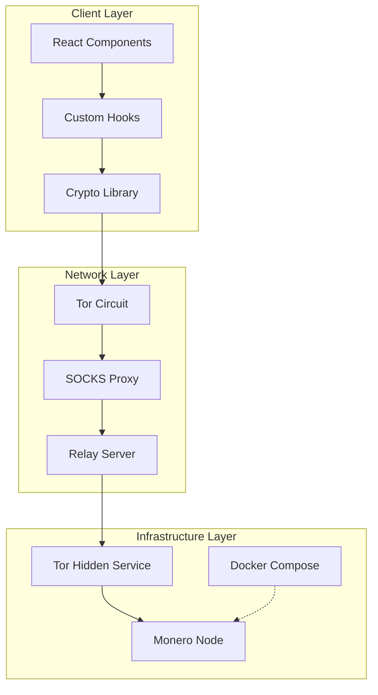
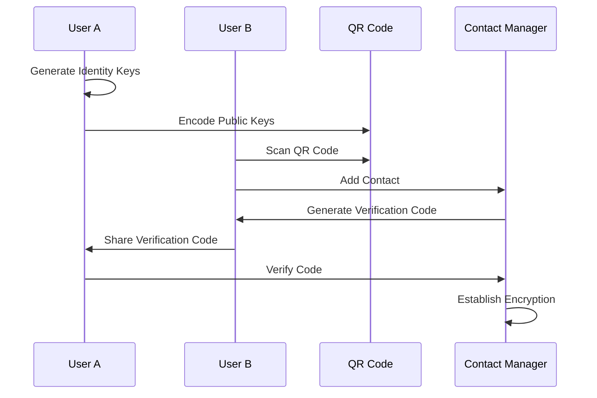
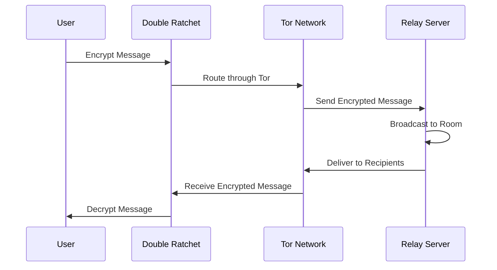
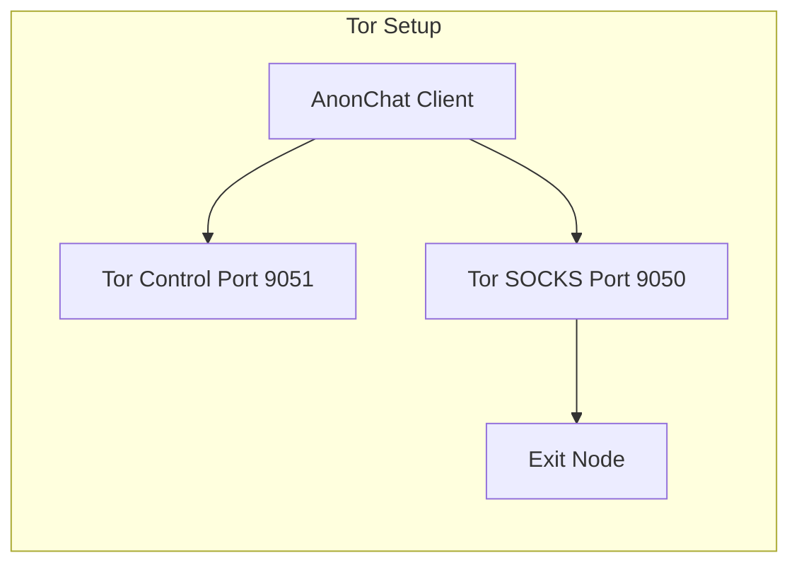
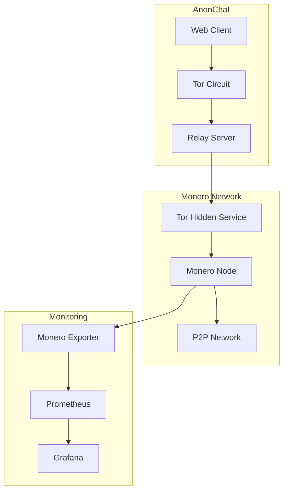

# AnonChat - Private Encrypted Messaging

[](LICENSE)
[](https://www.typescriptlang.org/)
[](https://nextjs.org/)
[](https://www.torproject.org/)

AnonChat is a zero-storage, end-to-end encrypted messaging system that combines Signal Protocol cryptography with Tor network anonymity. Built for privacy-conscious users who demand both security and anonymity in their communications.

## 🚀 Features

- **End-to-End Encryption**: Signal Protocol (X3DH + Double Ratchet) with forward secrecy
- **Tor Network Integration**: All traffic routed through Tor with automatic circuit rotation
- **Anonymous Chat Rooms**: Create and join encrypted rooms with rotating IP addresses
- **Contact Management**: QR code-based contact exchange with verification codes
- **Monero Integration**: Decentralized infrastructure with Tor hidden services
- **Zero Storage**: No message persistence on servers
- **Cross-Platform**: Web-based with PWA capabilities
- **Modern UI**: Built with Next.js, React, and Tailwind CSS

## 📋 Table of Contents

- [Architecture Overview](#architecture-overview)
- [Data Flows](#data-flows)
- [Security Implementation](#security-implementation)
- [Installation](#installation)
- [Usage](#usage)
- [API Reference](#api-reference)
- [Component Structure](#component-structure)
- [Hooks](#hooks)
- [Deployment](#deployment)
- [Monero Integration](#monero-integration)
- [Security Analysis](#security-analysis)
- [Improvements & Roadmap](#improvements--roadmap)
- [Contributing](#contributing)

## 🏗️ Architecture Overview



### Core Components

- **Frontend**: Next.js application with React components
- **Encryption**: WebCrypto-based Signal Protocol implementation
- **Networking**: Tor integration with SOCKS proxy agents
- **Backend**: Next.js API routes serving as relay server
- **Infrastructure**: Docker-based Monero node deployment

## 🔄 Data Flows

### Contact Establishment Flow



### Message Exchange Flow



## 🔒 Security Implementation

### Encryption Protocol

AnonChat implements the Signal Protocol with the following components:

#### X3DH Key Exchange
```typescript
// From lib/crypto.ts
export async function performX3DH(
  identityKeys: IdentityKeys,
  preKeys: PreKeys,
  remoteIdentityPublic: CryptoKey,
  remoteEphemeralPublic: CryptoKey
): Promise<X3DHSession> {
  // DH1: Identity key with remote ephemeral
  const dh1 = await crypto.subtle.deriveBits(
    { name: 'ECDH', public: remoteEphemeralPublic },
    identityKeys.privateKey,
    256
  );

  // DH2: Ephemeral key with remote identity
  const dh2 = await crypto.subtle.deriveBits(
    { name: 'ECDH', public: remoteIdentityPublic },
    preKeys.privateKey,
    256
  );

  // DH3: Pre-key with remote ephemeral
  const dh3 = await crypto.subtle.deriveBits(
    { name: 'ECDH', public: remoteEphemeralPublic },
    preKeys.privateKey,
    256
  );

  // KDF to combine DH outputs
  const combined = new Uint8Array([
    ...new Uint8Array(dh1),
    ...new Uint8Array(dh2),
    ...new Uint8Array(dh3),
  ]);

  const sharedSecret = await crypto.subtle.digest('SHA-256', combined);
  const sessionId = generateSessionId();

  return { sharedSecret, sessionId };
}
```

#### Double Ratchet Algorithm
```typescript
// From lib/double-ratchet-enhanced.ts
export class DoubleRatchetAlgorithm {
  static async ratchetSend(state: DoubleRatchetState): Promise<ArrayBuffer> {
    const { chainKey, messageKey } = await this.kdfChain(state.sendChainKey);
    state.sendChainKey = chainKey;
    state.sendMessageNumber++;
    return messageKey;
  }

  static async ratchetRecv(state: DoubleRatchetState): Promise<ArrayBuffer> {
    const { chainKey, messageKey } = await this.kdfChain(state.recvChainKey);
    state.recvChainKey = chainKey;
    state.recvMessageNumber++;
    return messageKey;
  }
}
```

### Tor Network Integration



```javascript
// From lib/torProxy.js
export async function getTorIP() {
  const maxAttempts = 5;
  let lastError;

  for (let attempt = 0; attempt < maxAttempts; attempt++) {
    try {
      const proxy = await getNextProxy();

      const proxyUrl = `socks5://${proxy.host}:${proxy.port}`;
      const agent = new SocksProxyAgent(proxyUrl);

      const response = await fetch('https://api.ipify.org?format=json', {
        agent,
        signal: controller.signal
      });

      const data = await response.json();
      return data.ip;
    } catch (error) {
      // Continue to next proxy
    }
  }
}
```

## 📦 Installation

### Prerequisites

- Node.js 18+
- npm or pnpm
- Docker and Docker Compose (for Monero integration)
- Tor (optional, fallback proxies available)

### Quick Start

1. **Clone the repository**
   ```bash
   git clone https://github.com/your-org/anon-chat-system-design.git
   cd anon-chat-system-design
   ```

2. **Install dependencies**
   ```bash
   pnpm install
   # or
   npm install
   ```

3. **Start development server**
   ```bash
   pnpm dev
   # or
   npm run dev
   ```

4. **Open in browser**
   ```
   http://localhost:3000
   ```

### Package.json Configuration

```json
{
  "name": "my-v0-project",
  "version": "0.1.0",
  "scripts": {
    "build": "next build",
    "dev": "next dev",
    "lint": "eslint .",
    "start": "next start"
  },
  "dependencies": {
    "@radix-ui/react-dialog": "1.1.4",
    "@radix-ui/react-dropdown-menu": "2.1.4",
    "crypto": "latest",
    "got": "^12.6.1",
    "next": "16.0.3",
    "qrcode": "^1.5.4",
    "react": "19.2.0",
    "socks-proxy-agent": "^8.0.5",
    "tor-control": "^0.0.3"
  }
}
```

## 🚀 Usage

### Basic Chat Flow

1. **Onboarding**: Complete the initial setup
2. **Create/Join Room**: Generate anonymous room or join existing
3. **Add Contacts**: Use QR codes to exchange contact information
4. **Verify Contacts**: Exchange verification codes for authentication
5. **Start Chatting**: Send encrypted messages through Tor

### Main Application Component

```typescript
// From app/page.tsx
export default function Home() {
  const [showOnboarding, setShowOnboarding] = useState(true);
  const [selectedRoom, setSelectedRoom] = useState<string | null>(null);
  const [currentView, setCurrentView] = useState<'rooms' | 'contacts'>('rooms');

  // Handle pending contacts from QR scans
  useEffect(() => {
    const pendingContact = localStorage.getItem('pending_contact');
    if (pendingContact) {
      // Process QR-scanned contact
      import('@/lib/contact-manager').then(({ contactManager }) => {
        const contactData = JSON.parse(pendingContact);
        contactManager.addContact(
          `Contact ${contactData.id.slice(-4)}`,
          {
            id: contactData.id,
            identityPublicKey: contactData.identityPublic,
            preKeyPublic: contactData.preKeyPublic,
            preKeyId: contactData.preKeyId,
            fingerprint: contactData.fingerprint
          }
        );
      });
    }
  }, []);

  // Render appropriate view
  return (
    <div className="flex h-screen bg-background">
      {/* Sidebar with room/contact tabs */}
      <div className="w-80 border-r border-border">
        {/* Tab navigation and content */}
      </div>

      {/* Main chat area */}
      {selectedRoom && (
        <ChatroomInterface
          roomId={selectedRoom}
          roomName={selectedRoomData.name}
          onLeaveRoom={handleLeaveRoom}
        />
      )}
    </div>
  );
}
```

## 📡 API Reference

### Relay API Endpoints

#### POST `/api/relay`
Initiate X3DH handshake and relay messages.

**Request Body:**
```json
{
  "action": "initiate-session|relay-message|receive-messages",
  "sessionId": "string",
  "encryptedPayload": "string",
  "recipientId": "string"
}
```

#### POST `/api/relay/rooms`
Create anonymous chat room.

**Response:**
```json
{
  "success": true,
  "roomId": "anon_123456",
  "userIP": "tor_exit_ip",
  "message": "Room created with anonymous IP"
}
```

#### POST `/api/relay/rooms/[roomId]/join`
Join a chat room.

**Request:**
```json
{
  "userId": "string",
  "username": "string",
  "timestamp": 1234567890
}
```

#### POST `/api/relay/rooms/[roomId]/messages`
Send encrypted message to room.

**Request:**
```json
{
  "id": "msg_123",
  "roomId": "room_123",
  "userId": "user_123",
  "username": "Alice",
  "encryptedContent": "base64_ciphertext",
  "iv": "base64_iv",
  "timestamp": 1234567890
}
```

## 🧩 Component Structure

### Core Components

#### ChatroomInterface
```typescript
// From components/chatroom-interface.tsx
interface ChatroomInterfaceProps {
  roomId: string;
  roomName: string;
  onOpenInfo: () => void;
  onLeaveRoom: () => void;
}

export function ChatroomInterface({ roomId, roomName, onOpenInfo, onLeaveRoom }: ChatroomInterfaceProps) {
  const [message, setMessage] = useState('');
  const { messages, users, currentUser, isConnected, sendMessage } = useChatroom(roomId, roomName);

  return (
    <div className="flex-1 flex flex-col bg-background">
      {/* Header with room info and QR button */}
      <div className="flex items-center justify-between px-6 py-4 border-b">
        <div className="flex items-center gap-3">
          <Badge variant="secondary" className="gap-1">
            <Shield className="w-3 h-3" />
            E2E Encrypted
          </Badge>
        </div>
        <QRContactModal isOpen={showQRModal} onClose={() => setShowQRModal(false)} />
      </div>

      {/* Messages area */}
      <div className="flex-1 overflow-y-auto px-6 py-4">
        {messages.map((msg) => (
          <div key={msg.id} className={`flex gap-3 ${isCurrentUser ? 'justify-end' : ''}`}>
            <div className={`px-4 py-2 rounded-2xl ${isCurrentUser ? 'bg-primary' : 'bg-muted'}`}>
              <p className="text-sm break-words">{msg.content}</p>
            </div>
          </div>
        ))}
      </div>

      {/* Input area */}
      <div className="px-6 py-4 border-t">
        <div className="flex gap-2">
          <Input
            placeholder="Type a message..."
            value={message}
            onChange={(e) => setMessage(e.target.value)}
            onKeyDown={(e) => e.key === 'Enter' && handleSendMessage()}
          />
          <Button onClick={handleSendMessage}>
            <Send className="w-4 h-4" />
          </Button>
        </div>
      </div>
    </div>
  );
}
```

### UI Component Library

The project uses Radix UI primitives with Tailwind CSS:

- **Dialogs**: Room join modal, contact verification
- **Navigation**: Tab-based room/contact switching
- **Forms**: Message input, settings panels
- **Feedback**: Toast notifications, loading states

## 🎣 Hooks

### useChatroom Hook

```typescript
// From hooks/use-chatroom.ts
export function useChatroom(roomId: string, roomName: string) {
  const [messages, setMessages] = useState<Message[]>([]);
  const [users, setUsers] = useState<RoomUser[]>([]);
  const [isConnected, setIsConnected] = useState(false);

  const currentUser = useState(() => ({
    id: `user_${Math.random().toString(36).substr(2, 9)}`,
    username: localStorage.getItem('anonchat_username') || `User${Math.floor(Math.random() * 9999)}`,
    color: USER_COLORS[Math.floor(Math.random() * USER_COLORS.length)],
  }))[0];

  // Initialize room encryption and join
  useEffect(() => {
    const initRoom = async () => {
      await roomEncryption.deriveRoomKey(roomId, 'shared-secret');
      const joinResult = await relayAPI.joinRoom(roomId, currentUser.id, currentUser.username);

      setUsers([{
        id: joinResult.userId,
        username: currentUser.username,
        color: currentUser.color,
        online: true,
        joinedAt: new Date(),
        ip: joinResult.userIP,
      }]);

      setIsConnected(true);
    };

    initRoom();
  }, [roomId, roomName, currentUser.id, currentUser.username, currentUser.color]);

  // Start polling for messages
  useEffect(() => {
    if (!isConnected) return;

    const handleNewMessages = async (relayMessages: RelayMessage[]) => {
      const decryptedMessages: Message[] = [];

      for (const msg of relayMessages) {
        const decrypted = await roomEncryption.decrypt({
          ciphertext: msg.encryptedContent,
          iv: msg.iv,
          tag: '',
        });

        decryptedMessages.push({
          id: msg.id,
          userId: msg.userId,
          username: msg.username,
          content: decrypted,
          timestamp: new Date(msg.timestamp),
          encrypted: true,
          ip: msg.ip,
        });
      }

      setMessages(prev => [...prev, ...decryptedMessages]);
    };

    relayAPI.startPolling(roomId, handleNewMessages);
  }, [isConnected, roomId, currentUser.id]);

  // Send message function
  const sendMessage = useCallback(async (content: string) => {
    const encrypted = await roomEncryption.encrypt(content.trim());

    const relayMessage: RelayMessage = {
      id: `msg_${Date.now()}_${Math.random().toString(36).substr(2, 9)}`,
      roomId,
      userId: currentUser.id,
      username: currentUser.username,
      encryptedContent: encrypted.ciphertext,
      iv: encrypted.iv,
      timestamp: Date.now(),
    };

    await relayAPI.sendMessage(relayMessage);

    const newMessage: Message = {
      id: relayMessage.id,
      userId: currentUser.id,
      username: currentUser.username,
      content: content.trim(),
      timestamp: new Date(),
      encrypted: true,
    };

    setMessages(prev => [...prev, newMessage]);
  }, [isConnected, roomId, currentUser.id, currentUser.username]);

  return {
    messages,
    users,
    currentUser,
    isConnected,
    sendMessage,
  };
}
```

## 🚢 Deployment

### Production Build

```bash
# Build the application
pnpm build

# Start production server
pnpm start
```

### Docker Deployment

```dockerfile
# Dockerfile
FROM node:18-alpine
WORKDIR /app
COPY package*.json ./
RUN npm ci --only=production
COPY . .
RUN npm run build
EXPOSE 3000
CMD ["npm", "start"]
```

### Environment Variables

```bash
# .env.local
NEXT_PUBLIC_TOR_CONTROL_PORT=9051
NEXT_PUBLIC_TOR_SOCKS_PORT=9050
NEXT_PUBLIC_RELAY_URL=https://your-relay-server.com
```

## ₿ Monero Integration

### Architecture



### Docker Compose Setup

```yaml
# From monerod/docker-compose.yml
version: '3.5'
services:
  monerod:
    image: ghcr.io/sethforprivacy/simple-monerod:latest
    volumes:
      - ./data/monerod-data:/home/monero/.bitmonero
    ports:
      - 18080:18080
      - 18081:18081
    command: ["--config-file=/home/monero/.bitmonero/bitmonero.conf"]

  tor:
    image: goldy/tor-hidden-service
    environment:
      MONEROD_TOR_SERVICE_HOSTS: '18080:monerod:18080,18089:monerod:18089'
      MONEROD_TOR_SERVICE_VERSION: '3'
    volumes:
      - ./data/tor-keys:/var/lib/tor/hidden_service/

  prometheus:
    image: prom/prometheus:latest
    volumes:
      - ./prometheus.yml:/etc/prometheus/prometheus.yml
    ports:
      - 9090:9090
```

### Deployment Steps

1. **Prepare VPS**
   ```bash
   sudo apt update && sudo apt install docker.io docker-compose-plugin -y
   ```

2. **Copy Monero Configuration**
   ```bash
   scp -r monerod user@vps:/home/user/
   cd /home/user/monerod
   chmod +x setup.sh && ./setup.sh
   ```

3. **Start Services**
   ```bash
   docker compose up -d
   ```

4. **Verify Deployment**
   ```bash
   docker compose logs -f monerod
   ```

## 🔍 Security Analysis

### Threat Model

**Assumptions:**
- Users trust their devices are not compromised
- Tor network provides anonymity
- WebCrypto API is secure in browser environment

**Threats Addressed:**
- ✅ **Eavesdropping**: End-to-end encryption
- ✅ **Metadata Leakage**: Tor routing + anonymous IDs
- ✅ **Key Compromise**: Forward secrecy via Double Ratchet
- ✅ **Man-in-the-Middle**: X3DH authentication
- ✅ **Correlation Attacks**: Circuit rotation

**Remaining Risks:**
- ⚠️ **Browser Fingerprinting**: Not addressed
- ⚠️ **Malware/Keyloggers**: Out of scope
- ⚠️ **Tor Correlation**: Limited by exit node selection
- ⚠️ **Side Channels**: Timing attacks mitigated

### Cryptographic Security

- **Key Exchange**: X3DH with ECDSA/ECDH P-256
- **Symmetric Encryption**: AES-256-GCM
- **Key Derivation**: HKDF-SHA256
- **Forward Secrecy**: Double Ratchet with ECDH ratchets
- **Authentication**: HMAC-SHA256

## 🔧 Improvements & Roadmap

### High Priority

1. **Persistent Storage**
   - Replace in-memory sessions with Redis/PostgreSQL
   - Encrypted message history (optional)
   - Contact backup/restore functionality

2. **Scalability**
   - Multi-server federation
   - Load balancing for relay servers
   - Horizontal scaling support

3. **Security Enhancements**
   - Security audit and penetration testing
   - Automated security testing suite
   - Key rotation policies

### Medium Priority

4. **User Experience**
   - Mobile PWA support
   - Offline message queuing
   - File/image sharing (encrypted)
   - Voice/video calls (WebRTC + DTLS)

5. **Privacy Features**
   - Self-destructing messages
   - Screenshot detection
   - Metadata stripping
   - Plausible deniability

### Future Considerations

6. **Advanced Cryptography**
   - Post-quantum key exchange
   - Zero-knowledge proofs
   - Multi-device synchronization

7. **Network Features**
   - Decentralized relay network
   - Mesh networking support
   - Tor hidden service directories

8. **Compliance & Audit**
   - Optional audit logging
   - Compliance modes for regulated environments
   - Third-party security reviews

## 🤝 Contributing

### Development Setup

1. Fork the repository
2. Create feature branch: `git checkout -b feature/amazing-feature`
3. Install dependencies: `pnpm install`
4. Start development: `pnpm dev`
5. Run tests: `pnpm test`
6. Commit changes: `git commit -m 'Add amazing feature'`
7. Push to branch: `git push origin feature/amazing-feature`
8. Open Pull Request

### Code Standards

- **TypeScript**: Strict type checking enabled
- **ESLint**: Airbnb config with React rules
- **Prettier**: Automated code formatting
- **Testing**: Jest for unit tests, Cypress for E2E

### Security Considerations

- Never commit private keys or sensitive data
- Use environment variables for configuration
- Follow cryptographic best practices
- Report security issues privately

## 📄 License

This project is licensed under the MIT License - see the [LICENSE](LICENSE) file for details.

## 🙏 Acknowledgments

- **Signal Foundation**: For the Signal Protocol specification
- **Tor Project**: For providing anonymity infrastructure
- **Monero Community**: For privacy-focused cryptocurrency
- **Open Source Community**: For the libraries and tools used

---

**Disclaimer**: This software is provided as-is for educational and research purposes. Users are responsible for complying with applicable laws and regulations in their jurisdiction.
